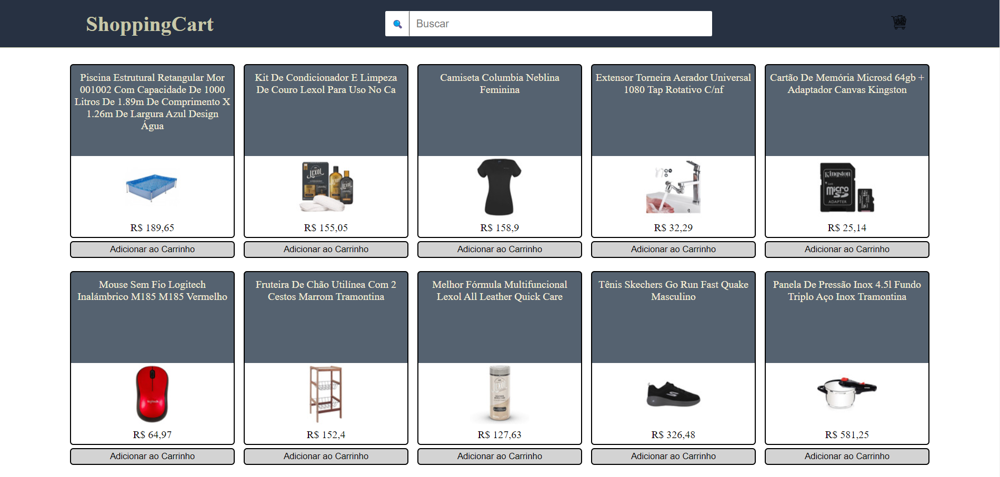

# shopping-cart

## 📝 Descrição:

Repositório destinado ao versionamento do código referente ao Projeto <b>ShoppingCart</b> desemvolvido em <b>HTML, CSS e JavaScript</b>.

Aproposta do projeto é de colocar em prática o que venho aprendendo com os meus estudos de HTML, CSS e JS.

## 🎯 Objetivos:

- Criar uma página WEB utilizando HTML, CSS e JS;
- Fazer requisições a uma API _(Application Programming Interface)_ do Mercado Livre;
- Utilizar os seus conhecimentos sobre JavaScript, CSS e HTML;
- Trabalhar com funções assíncronas;

## 🛠 Tecnologias utilizadas:

  
  
  
  
  
  

## Imagem da Aplicação

