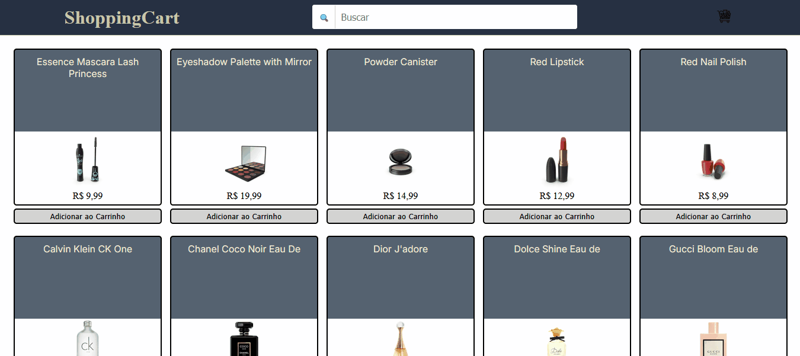

# 🛒 ShoppingCart

Este é um projeto de carrinho de compras dinâmico desenvolvido em **JavaScript Vanilla**, que consome a API **DummyJSON** para listar produtos e gerenciar pedidos. O objetivo principal foi aplicar conceitos modernos de JavaScript assíncrono, manipulação limpa do DOM e boas práticas de organização e refatoração de código.

---

## 🎥 Demonstração



---

## 🚀 Tecnologias Utilizadas

- **HTML5**
  - Estrutura semântica para acessibilidade e SEO.
- **CSS3**
  - Metodologia BEM (Block Element Modifier) para organização e manutenção.
  - Flexbox para o layout responsivo da vitrine e do carrinho.
- **JavaScript (ES6+)**
  - Fetch API com async/await para consumo de dados assíncronos.
  - Tratamento de exceções com try...catch para resiliência da aplicação.
  - Manipulação dinâmica do DOM para renderização de componentes e feedback de carregamento.
  - Utilização de métodos de array (map, forEach, filter) para gerenciamento de dados e cálculo de totais.

---

## 🛠️ Funcionalidades

- **Listagem de Produtos**
  - Consumo de API externa para exibição dinâmica dos itens.

- **Barra de Pesquisa**
  - Busca de produtos utilizando o endpoint de pesquisa da API.

- **Carrinho Interativo**
  - Adição de produtos ao carrinho.
  - Cálculo automático do valor total.
  - Remoção de itens ao clicar no produto do carrinho.
  - Botão para esvaziar completamente o carrinho.

- **Feedback Visual**
  - Indicador de carregamento durante requisições.
  - Tratamento de erros de conexão com mensagens ao usuário.

---

## 📈 Evolução Técnica

Durante o desenvolvimento, o projeto passou por refatorações importantes visando boas práticas de mercado:

- **Migração de Promises**
  - Substituição de `.then()` por `async/await` para maior legibilidade e controle de fluxo.

- **Redução do Acoplamento ao DOM**
  - IDs passaram a ser enviados diretamente para funções, evitando dependência da estrutura HTML (`parentNode`).

- **Clean Code**
  - Remoção de código morto/comentado.
  - Padronização de nomes de funções e variáveis.
  - Organização lógica do código.

---

## 📚 Aprendizados

- Consumo de APIs REST com Fetch API
- Controle de fluxo assíncrono em JavaScript
- Tratamento de erros no frontend
- Manipulação eficiente do DOM sem frameworks
- Refatoração e organização de código JavaScript
- Preparação de projetos para migração futura para frameworks (React)

---

## 🔮 Próximos Passos

- [ ] Separar responsabilidades em módulos
- [ ] Criar estado global do carrinho
- [ ] Persistir dados utilizando `localStorage`
- [ ] Melhorar acessibilidade (A11y)
- [ ] Migração completa para React utilizando Hooks (useState, useEffect)

---

## 🔧 Como Rodar o Projeto

1. Clone o repositório:
   ```bash
   git clone https://github.com/seu-usuario/shopping-cart.git
   ```
2. Acesse a pasta do projeto:

   ```bash
   cd shopping-cart
   ```

3. Abra o arquivo index.html no navegador ou utilize a extensão Live Server no VS Code.
